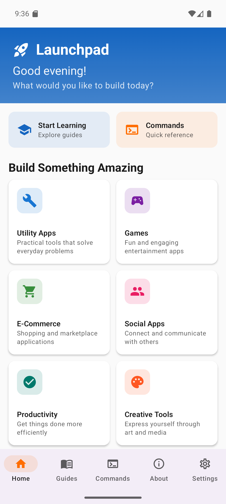
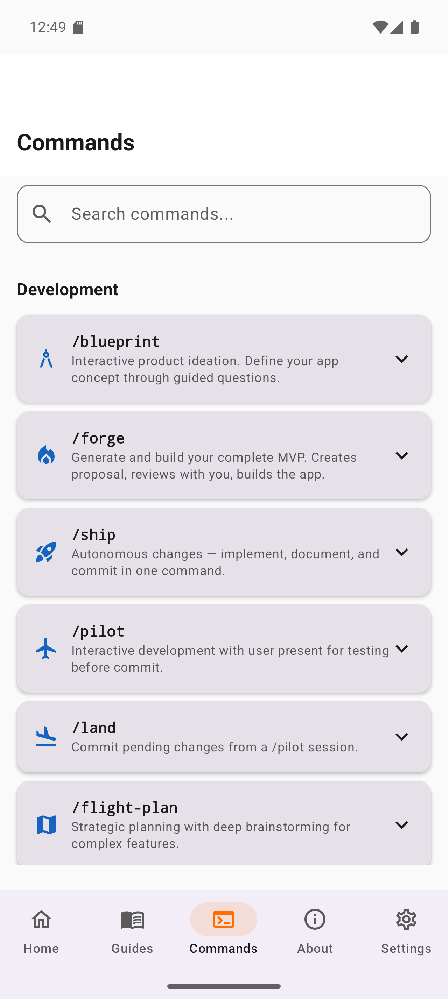

# 🚀 Launchpad

> Your AI-powered launchpad for rapidly building Android applications with Claude Code.

<div align="center">

<table>
<tr>
<td align="center">

<br/>
<sub><b>Home Screen</b></sub>
</td>
<td align="center">

<br/>
<sub><b>Commands Reference</b></sub>
</td>
</tr>
</table>

</div>

---

## What is Launchpad?

Launchpad is a custom Android project template specifically designed to work seamlessly with **Claude Code** — Anthropic's AI-powered development assistant. It provides the foundation and tooling to help you rapidly ideate, iterate, and build Android applications of all kinds.

Whether you're prototyping a new idea, building an MVP, or creating a full-featured app, Launchpad gives you:

- **AI-First Workflow** — Built from the ground up to leverage Claude Code's capabilities
- **Rapid Iteration** — Go from idea to running app in minutes, not hours
- **Smart Automation** — Intelligent commands for building, testing, and deploying
- **Structured Development** — Prompt-based system for organized, reproducible development

---

## ✨ Features

| Feature | Description |
|---------|-------------|
| **AI-Assisted Development** | Claude Code understands your project structure and helps you build faster |
| **Automated Build Pipeline** | `/build`, `/install`, `/run` commands with smart error handling |
| **Intelligent Commits** | Auto-numbered commits with smart message generation |
| **Prompt System** | Create, execute, and log development prompts |
| **Product Doc Integration** | AI reads your product docs to understand your vision |
| **Context-Aware Assistance** | Claude maintains context about your specific app |

---

## 🏁 Getting Started

### Environment Setup

<table>
<tr>
<td width="33%" align="center">

**Windows 11**

✅ Available

[Setup Guide](./ENVIRONMENT_SETUP_WIN11.md)

</td>
<td width="33%" align="center">

**macOS**

🚧 Coming Soon

</td>
<td width="33%" align="center">

**Linux**

🚧 Coming Soon

</td>
</tr>
</table>

### Quick Start

**Option 1: Clone (Exploring / Learning)**
```bash
# Clone to explore Launchpad's capabilities
git clone https://github.com/WaseemTheDream/launchpad.git
cd launchpad
```

**Option 2: Fork & Rename (You Know Your App Name)**

If you already know what you're building, fork the repository and name it after your app:

1. Click **Fork** on [github.com/WaseemTheDream/launchpad](https://github.com/WaseemTheDream/launchpad)
2. Name the new repository after your app (e.g., `fittrack`, `recipe-vault`, `budgetwise`)
3. Clone your fork:
   ```bash
   git clone https://github.com/YOUR_USERNAME/your-app-name.git
   cd your-app-name
   ```

> **Why fork?** Your repository name becomes your project identity. When you run `/forge`, it will rename the Android package to match. Starting with the right name means cleaner git history and easier deployment.

**Then continue with:**
```bash
# Set up your environment (see guides above)

# Open in Android Studio
# File → Open → Select the project folder

# Start Claude Code in the integrated terminal
claude
```

---

## 🎯 Adapting Launchpad to Your Idea

Launchpad is designed to be **transformed into YOUR Android application**. Choose your path:

---

### Option A: You Already Have an Idea (Recommended: Fork First)

If you know what you want to build:

**Step 0 (Optional but Recommended):** If you haven't already, fork this repository and name it after your app. This gives you a clean starting point with the right project name.

**Step 1:** Place your product documentation in the `product-docs/` folder:

```
product-docs/
├── vision.md       # What is your app? What problem does it solve?
├── features.md     # Core features and functionality
├── audience.md     # Who are your users?
├── design.md       # Design preferences, colors, style
└── references/     # Screenshots, wireframes, inspiration
```

Don't worry about being perfect — even rough notes help Claude understand your vision.

**Step 2:** Run Blueprint to initialize your project:

```
/blueprint
```

Blueprint will analyze your docs, ask clarifying questions, and set everything up.

---

### Option B: You Need Help Ideating

Don't have a fully formed idea yet? No problem! Just run:

```
/blueprint
```

**The Blueprint command will interactively help you:**

1. 💡 **Brainstorm** your app concept through guided questions
2. 🎯 **Define** your target audience and core features
3. 🏗️ **Shape** technical requirements and design preferences
4. 🧠 **Generate** context files capturing your vision
5. 📝 **Create** an initialization prompt for your app
6. ✅ **Commit** everything to get you started

You don't need any documentation prepared — Blueprint's interactive questionnaire will guide you through defining your entire product vision from scratch.

---

### Understanding the Commands

| Command | Purpose | When to Use |
|---------|---------|-------------|
| `/blueprint` | **Product Ideation** | Define your app concept, features, and requirements |
| `/forge` | **MVP Generation** | Build your complete working prototype |
| `/ship` | **Change Execution** | Autonomous changes — implement, document, commit |
| `/pilot` | **Interactive Development** | Hands-on changes with user present for testing |
| `/land` | **Commit Pilot Changes** | Commit pending changes from a /pilot session |
| `/flight-plan` | **Strategic Planning** | Deep brainstorming for complex features |

**Blueprint** is for ideation and context gathering. It works great in both scenarios:
- **With product docs**: Analyzes your documentation, identifies gaps, and asks targeted questions to fill them in
- **Without product docs**: Guides you through comprehensive questions to define your entire product vision from scratch

Either way, Blueprint ensures Claude has complete context about your app before building begins.

**Forge** is for building — once your vision is defined, it creates a complete MVP proposal, reviews it with you, and builds the entire working app.

**Ship** is for autonomous changes — voice-friendly command that implements your request, documents it, and commits. Say "Ship add a login screen" and it happens.

**Pilot** is for interactive development — when you want to be present, answer questions, test the app, and verify changes before committing. Run `/land` when done.

**Flight Plan** is for strategic planning — when you have a complex feature and want to brainstorm requirements, architecture, and implementation details before executing.

---

### Step 3: Build Your MVP with Forge

After Blueprint completes, run:

```
/forge
```

**The Forge command will:**

1. 📋 **Analyze** your context files from Blueprint
2. 🏗️ **Generate** a detailed MVP proposal (screens, architecture, data models)
3. 👀 **Review** the proposal with you and incorporate feedback
4. 🔥 **Build** the complete working prototype
5. ✅ **Commit** all code with meaningful commit messages

### Step 4: Iterate with AI Assistance

With your MVP built, continue developing with Claude Code:

```
"Add a login screen with email and password"

"Create a bottom navigation with Home, Search, and Profile tabs"

"Implement dark mode support"

"Add offline caching for the user's data"

"Fix the crash that happens when the network is unavailable"
```

Claude understands your app's context and generates code that fits your architecture.

---

## 📁 Project Structure

```
launchpad/
├── app/                          # Android application module
│   └── src/main/
│       ├── java/.../             # Kotlin source files
│       └── res/                  # Resources (layouts, strings, etc.)
│
├── product-docs/                 # YOUR product documentation
│   └── (your docs here)
│
├── .claude/
│   ├── commands/                 # Claude Code commands
│   │   ├── blueprint.md          # /blueprint - Initialize your project
│   │   ├── forge.md              # /forge - Build your MVP
│   │   ├── ship.md               # /ship - Autonomous changes
│   │   ├── pilot.md              # /pilot - Interactive development
│   │   ├── land.md               # /land - Commit pilot changes
│   │   ├── flight-plan.md        # /flight-plan - Strategic planning
│   │   ├── queue.md              # /queue - Save tasks for later
│   │   ├── burn.md               # /burn - Process queued tasks
│   │   ├── reboot.md             # /reboot - Resume interrupted work
│   │   ├── build.md              # /build - Compile the app
│   │   ├── install.md            # /install - Deploy to device
│   │   ├── run.md                # /run - Build, install, launch
│   │   ├── release.md            # /release - Build signed APK
│   │   └── execute-prompt.md     # /execute-prompt - Run prompt files
│   │
│   ├── android-keystore/         # Release signing (git-ignored)
│   │   ├── release.jks           # Your keystore file
│   │   └── keystore.properties   # Keystore credentials
│   │
│   ├── skills/                   # Claude Code skills
│   │   ├── app.md                # App lifecycle management
│   │   ├── commit.md             # Intelligent commits
│   │   └── prompt-creator.md     # Create numbered prompts
│   │
│   ├── prompts/                  # Development prompts
│   │   └── logs/                 # Execution logs
│   │
│   └── context/                  # AI context files (generated)
│
├── ENVIRONMENT_SETUP_WIN11.md    # Windows setup guide
└── README.md                     # You are here
```

---

## 🛠️ Available Commands

### Development Commands
| Command | Description |
|---------|-------------|
| `/blueprint` | 📐 Design your product vision and create project foundation |
| `/forge` | 🔥 Generate and build your complete MVP |
| `/ship <request>` | 🚀 Autonomous changes — implement, document, commit |
| `/pilot <request>` | 🛫 Interactive development with user testing before commit |
| `/land` | 🛬 Commit pending changes from a /pilot session |
| `/flight-plan <idea>` | 📋 Strategic planning with deep brainstorming |

### Workflow Commands
| Command | Description |
|---------|-------------|
| `/queue <task>` | 📥 Save task for later when AI is busy |
| `/burn` | 🔥 Execute all queued tasks sequentially |
| `/reboot [session]` | 🔄 Resume interrupted work from progress logs |

### Build & Deploy Commands
| Command | Description |
|---------|-------------|
| `/build` | 🔨 Build the Android app |
| `/build clean` | 🧹 Clean build from scratch |
| `/install` | 📲 Build and install to device/emulator |
| `/run` | ▶️ Build, install, and launch the app |
| `/release` | 📦 Build signed release APK |
| `/execute-prompt <file>` | 📜 Execute a prompt file with logging |

---

## 📦 Release Builds

When you're ready to distribute your app, you'll need to create a signed release APK. This section covers keystore setup for both new and experienced Android developers.

### Quick Start

```
/release
```

The `/release` command will guide you through keystore setup if needed, then build your signed APK.

---

### Option A: I Have an Existing Keystore

If you already have a `.jks` keystore file from previous Android development:

**Step 1: Copy your keystore**
```bash
# Copy your existing keystore to the project
cp /path/to/your/existing.jks .claude/android-keystore/release.jks
```

**Step 2: Create credentials file**

Create `.claude/android-keystore/keystore.properties`:
```properties
storeFile=../.claude/android-keystore/release.jks
storePassword=your_keystore_password
keyAlias=your_key_alias
keyPassword=your_key_password
```

**Step 3: Build release**
```
/release
```

---

### Option B: I Need to Create a Keystore

If this is your first Android app or you need a new keystore:

**Step 1: Generate keystore**

Open a terminal and run:
```bash
keytool -genkey -v -keystore .claude/android-keystore/release.jks -keyalg RSA -keysize 2048 -validity 10000 -alias release
```

You'll be prompted for:
- **Keystore password**: Choose a strong password (you'll need this forever!)
- **Personal info**: Name, organization, etc. (can use defaults)
- **Key password**: Can be the same as keystore password

**Step 2: Create credentials file**

Create `.claude/android-keystore/keystore.properties`:
```properties
storeFile=../.claude/android-keystore/release.jks
storePassword=your_chosen_password
keyAlias=release
keyPassword=your_key_password
```

**Step 3: Build release**
```
/release
```

---

### Security Best Practices

| Practice | Description |
|----------|-------------|
| **Back up your keystore** | Store your `.jks` file in a secure location (cloud backup, USB drive). If lost, you cannot update your app on Play Store. |
| **Never commit credentials** | Keystore files are protected by both the root `.gitignore` and `.claude/android-keystore/.gitignore`. Never manually add these files to git. |
| **Use strong passwords** | Your keystore protects your app's identity. Use passwords you won't forget but others can't guess. |
| **Document your credentials** | Store your alias and passwords securely (password manager recommended). |

### Output Location

After a successful release build, your signed APK will be at:
```
app/build/outputs/apk/release/app-release.apk
```

---

## 💡 Tips for Working with Claude

1. **Be Specific** — "Add a button" vs "Add a floating action button in the bottom-right that opens a new task dialog"

2. **Provide Context** — Reference your product docs: "Based on the features in product-docs/features.md, implement the search functionality"

3. **Iterate Quickly** — Don't aim for perfection. Build, test, refine.

4. **Use Prompts** — For complex features, create a prompt file to capture requirements

5. **Commit Often** — Use the commit skill to save progress with meaningful messages

---

## ⚡ Autonomous Mode

For a more hands-free development experience, you can run Claude Code with the `--dangerously-skip-permissions` flag:

```bash
claude --dangerously-skip-permissions
```

This enables Claude to execute commands, modify files, and perform actions without prompting for confirmation at each step — significantly speeding up development workflows.

### ⚠️ Important Warnings

> **This mode is NOT recommended for production environments.**

Before using autonomous mode, understand these risks:

| Risk | Description |
|------|-------------|
| **Irreversible Changes** | Claude can make permanent modifications to your codebase, delete files, or execute system commands without confirmation |
| **No Safety Prompts** | You won't be asked to approve potentially destructive operations |
| **Your Responsibility** | You are fully responsible for reviewing all changes Claude makes |
| **Production Danger** | Never use this flag when working on live production systems where mistakes could affect real users or data |

### ✅ Best Practices for Safe Usage

If you choose to use autonomous mode, follow these guidelines:

1. **Use Version Control** — Always have your work committed to git before starting. This gives you a safety net to revert changes.

2. **Work in Isolation** — Use a development or sandbox environment, never a production system.

3. **Review Changes Frequently** — Run `git diff` regularly to see what Claude has modified.

4. **Keep Backups** — Ensure you have backups of any critical data or configurations.

5. **Start Small** — Test autonomous mode on simple tasks before using it for complex operations.

6. **Set Boundaries** — Be specific in your instructions to limit the scope of what Claude can change.

### When to Use Autonomous Mode

**Good use cases:**
- Rapid prototyping in a fresh project
- Exploring ideas in a disposable environment
- Running repetitive tasks you've done manually before
- Development on isolated feature branches

**Avoid for:**
- Production deployments
- Database migrations on live data
- Operations affecting external services
- Any environment where mistakes are costly

---

## 🤝 Contributing

Contributions are welcome! If you have ideas for improving Launchpad:

1. Fork the repository
2. Create a feature branch
3. Make your changes
4. Submit a pull request

---

## 📄 License

This project is open source and available under the [MIT License](LICENSE).

---

<div align="center">

**Built with 🤖 and ❤️ for the Android developer community**

[Report Bug](https://github.com/WaseemTheDream/launchpad/issues) · [Request Feature](https://github.com/WaseemTheDream/launchpad/issues)

</div>
